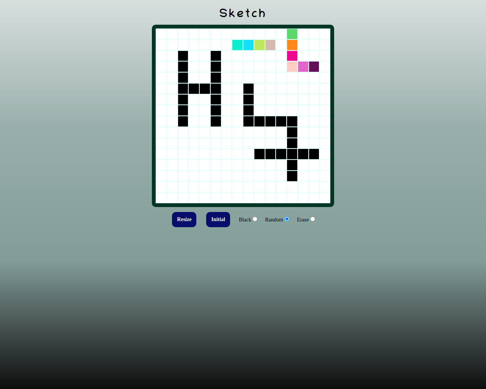

# Etch-a-sketch page

> This project is made as part of TheOdinProject  web dev 101 course

Sample of static web page 

## Built With

- HTML
- CSS
- JavaScript

## Live Demo

[Live Demo Link](https://igors78.github.io/Sketch/)

## Getting Started
**This project created as part of TOP, responsive web-design course. Start drawing by left-click on the mouse, stop by the second click. While 
drawing the cursor changes to cross-pointer. Change the colorizing to random rainbow by selecting appropriate button. 
Select erase button to decolorize the draw. Resize the field by entering side size
(Resize button). Return to initial field size by pressing Initial button.**
**See the page via the link above**

## Authors

👤 **Author**

- GitHub: [@github](https://github.com/Igors78)
- Twitter: [@twitter](https://twitter.com/oleinikovs)
- LinkedIn: [LinkedIn](https://www.linkedin.com/in/igors-oleinikovs-17a10958/)

## Show your support

Give a ⭐️ if you like this project!

## 📝 License

This project is [MIT](./license.txt) licensed.
